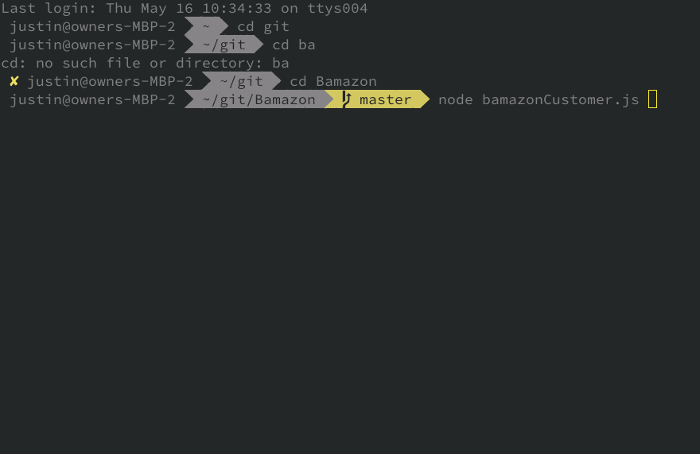
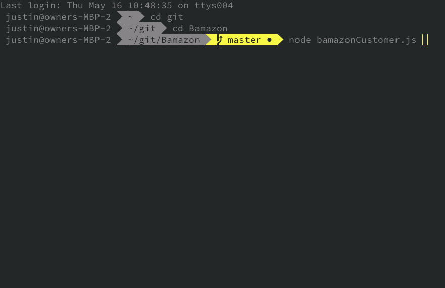

# Bamazon
Off brand of your favorite web store

## Standard Flow

Here is the standard flow of the app. A user selects an item based on its ID, they define a quantity, then the app checks inventory to ensure there are enough items. Once successful, it displays the item was updated successfully. 

> Not displayed here, but viewable in bamazonCustomer.js: there is validation for both inputs, only allowing the user to enter a number.

## Over Order

## Out Of Stock

